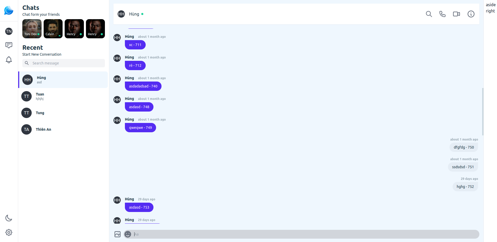

# Chat application

## General Information
- Create conversation with friend.
- Interact by send message, icon, image.
- Can chat video call, voice call together.
<!-- You don't have to answer all the questions - just the ones relevant to your project. -->

## Technologies Used
- Backend: Laravel8, Mysql,SocketIo, Redis, Jwt.
- Frontend: Vue3, TailwindCss, ...

## Features
List the ready features here:
- Send message with friend.
- Find friend.
- Request/Accept friend.

List the features is buidling:
- Chat video call, voice call.
- Add/Update Profile.
- Setup theme, background UI.

## Screenshots

<!-- If you have screenshots you'd like to share, include them here. -->

## Setup
1. Clone project.
2. Run API:
  - Install redis: composer require predis/predis
  - Start redis.
  - Composer install.
  - Config file .env .
  - Start api: php artisan serve.
  - Start queue worker: php artisan queue:work.
  - Start server socket: cd api/socket_server => node server.js  
  (I use laradock to start redis and this project https://laradock.io/)
3. Run client (Vuejs)
  - cd client.
  - npm install.
  - npm run serve.

`write-your-code-here`

## Project Status
Project is: _in progress

<!-- Optional -->
<!-- ## License -->
<!-- This project is open source and available under the [... License](). -->

<!-- You don't have to include all sections - just the one's relevant to your project -->
